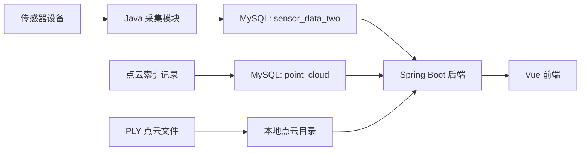

# 作物生长环境与表型关联分析系统技术手册

## 1. 文档说明

本文档以当前版本 `sensor-platform` 为准，覆盖系统组成、运行流程、页面功能、接口、数据库、迁移部署和一键启动/关闭脚本。

当前工程路径：

```text
E:\study\sensor-platform
```

当前版本定位：

- 本系统不负责传感器硬件数据采集算法本身。
- Java 采集模块负责接收传感器上报数据并写入 MySQL。
- Spring Boot 后端负责读取数据库、提供点云文件和系统状态接口。
- Vue 前端负责展示传感器趋势、点云、运行状态和交互控制。
- 用户权限暂未实现，当前按本地电脑单机运行设计。

## 2. 系统组成

| 模块 | 路径 | 作用 |
| --- | --- | --- |
| Java 采集模块 | `JavaSDKV2.2.2\Demo` | 监听 `2404`，接收传感器数据并写入 MySQL |
| Spring Boot 后端 | `backend` | 提供 `/api` 接口，读取传感器数据、点云记录和点云文件 |
| Vue 前端 | `frontend` | 展示仪表盘、趋势图、点云和系统状态 |
| 一键脚本 | `start-system.bat`、`stop-system.bat`、`scripts` | 启动和关闭本地运行环境 |
| 文档 | `docs` | 技术手册、API 说明和 Word 手册 |

核心目录：

```text
sensor-platform
├─ JavaSDKV2.2.2\Demo
├─ backend
├─ frontend
├─ scripts
├─ docs
├─ start-system.bat
└─ stop-system.bat
```

## 3. 技术栈

| 层级 | 技术 | 当前用途 |
| --- | --- | --- |
| 采集模块 | Java、RSNetDevice SDK、MySQL JDBC | 接收设备数据并写表 |
| 后端服务 | Spring Boot、Maven、JDBC | API 服务、数据库读取、本地文件读取、状态检查 |
| 前端页面 | Vue 3、TypeScript、Vite | 仪表盘和交互界面 |
| 图表 | ECharts | 温度、湿度、光照趋势图 |
| 点云 | Three.js、PLYLoader、OrbitControls | `.ply` 点云渲染和视角控制 |
| 数据库 | MySQL | 保存传感器数据和点云索引 |
| 启动脚本 | PowerShell、BAT | 本地一键启动和关闭 |

## 4. 数据流



说明：

- 传感器实时/存储数据由 Java 采集模块写入 `sensor_data_two`。
- 点云 `.ply` 文件由外部提供，文件本体放在本地目录。
- `point_cloud.file_name` 只保存文件名，后端根据配置目录查找文件。
- 前端只访问 Spring Boot 后端接口，不直接连接数据库或读取本地文件。

## 5. 数据库设计

数据库名称：

```text
sensor
```

### 5.1 传感器表

表名：

```text
sensor_data_two
```

字段：

| 字段 | 类型建议 | 说明 |
| --- | --- | --- |
| `id` | `BIGINT AUTO_INCREMENT` | 可选主键，后端兼容没有该字段的情况 |
| `device_id` | `VARCHAR(64)` | 设备编号 |
| `node_id` | `INT` | 节点编号 |
| `temperature` | `DOUBLE` | 温度 |
| `humidity` | `DOUBLE` | 湿度 |
| `light_intensity` | `DOUBLE` | 光照强度 |
| `record_time` | `DATETIME` | 记录时间 |

建表参考：

```sql
CREATE TABLE IF NOT EXISTS sensor_data_two (
  id BIGINT PRIMARY KEY AUTO_INCREMENT,
  device_id VARCHAR(64) NOT NULL,
  node_id INT NOT NULL,
  temperature DOUBLE,
  humidity DOUBLE,
  light_intensity DOUBLE,
  record_time DATETIME NOT NULL,
  INDEX idx_sensor_record_time (record_time)
);
```

### 5.2 点云表

表名：

```text
point_cloud
```

字段：

| 字段 | 类型建议 | 说明 |
| --- | --- | --- |
| `id` | `BIGINT AUTO_INCREMENT` | 主键 |
| `record_time` | `DATETIME` | 点云记录时间 |
| `file_name` | `VARCHAR(255)` | 点云文件名，例如 `Stage_Flowering.ply` |

建表参考：

```sql
CREATE TABLE IF NOT EXISTS point_cloud (
  id BIGINT PRIMARY KEY AUTO_INCREMENT,
  record_time DATETIME NOT NULL,
  file_name VARCHAR(255) NOT NULL,
  INDEX idx_point_cloud_record_time (record_time)
);
```

## 6. 后端配置

配置文件：

```text
backend\src\main\resources\application.yml
```

当前主要配置：

```yaml
server:
  port: 8080

app:
  datasource:
    url: jdbc:mysql://127.0.0.1:3306/sensor?useUnicode=true&characterEncoding=utf8&serverTimezone=Asia/Shanghai
    username: root
    password: "269756"
  point-cloud:
    directory: E:/study/new_sensor/pointCloud
  cors:
    allowed-origins: http://localhost:5173,http://127.0.0.1:5173
```

迁移到新电脑时必须确认：

- 数据库地址、端口、库名是否正确。
- MySQL 用户名和密码是否正确。
- 点云目录是否存在。
- 前端地址是否仍为 `localhost:5173`。

## 7. 采集模块说明

采集入口：

```text
JavaSDKV2.2.2\Demo\src\main\java\demo\Application.java
```

采集逻辑：

```text
JavaSDKV2.2.2\Demo\src\main\java\demo\DataCollector.java
```

当前采集模块行为：

- 加载 MySQL 驱动。
- 使用 `RSNetDevice` SDK 初始化监听服务。
- 监听端口：`2404`。
- 解析传感器节点数据。
- 将数据写入 `sensor_data_two`。
- 使用 `param.dat` 作为 SDK 参数文件。

采集模块依赖文件：

```text
JavaSDKV2.2.2\Demo\param.dat
JavaSDKV2.2.2\Demo\lib\RSNetDevice-2.2.2.jar
```

采集字段写入：

```text
sensor_data_two(device_id, node_id, temperature, humidity, light_intensity, record_time)
```

## 8. 前端功能

### 8.1 首页

首页展示系统名称和入口按钮。点击“进入系统”后进入仪表盘。

### 8.2 仪表盘

仪表盘包含：

- 顶部标题区。
- 系统状态按钮。
- 刷新数据按钮。
- 返回首页按钮。
- 设备编号、最近更新、数据记录、点云文件概览。
- 时间粒度、日期范围、目标温度筛选。
- 作物点云图。
- 传感器趋势图。
- 右侧指标切换器。

### 8.3 系统状态页

点击右上角“系统状态”按钮后，会展开运行状态面板。

状态检查项：

| 检查项 | 检查方式 | 说明 |
| --- | --- | --- |
| Spring Boot 后端 | 当前接口响应 | 后端能返回状态接口即为正常 |
| MySQL 数据库 | 后端执行 `SELECT 1` | 检查数据库连接是否可用 |
| Java 采集模块 | 后端检查 `127.0.0.1:2404` | 判断采集模块是否监听 |
| 点云文件目录 | 后端检查本地目录 | 判断配置目录是否存在 |

后端状态接口：

```http
GET /api/system/status
```

### 8.4 传感器趋势图

趋势图使用 ECharts，支持：

- 综合视图。
- 温度。
- 湿度。
- 光照。
- 目标温度参考线。
- 点云时间标记线。
- 实时、小时、天、周粒度切换。

当前版本已加入 `ResizeObserver`，图表会随面板尺寸变化自动重绘。

### 8.5 点云展示

点云展示使用 Three.js，支持：

- `.ply` 文件加载。
- 上一个/下一个点云切换。
- 自动轮播与暂停。
- OrbitControls 鼠标旋转、缩放、平移。
- 随面板尺寸变化自动调整画布。

点云控制面板支持：

- 点大小。
- 透明度。
- 背景色。
- 原始颜色/自定义颜色。
- 自动旋转。
- 旋转速度。
- 重置视角。
- 收起/展开。

### 8.6 右侧指标切换器

当前版本已重做右侧指标 UI，包含：

- 综合视图。
- 温度。
- 湿度。
- 光照。

每个指标卡包含侧边色条、圆形图标、指标说明和实时数值。点击后会切换趋势图展示指标。

### 8.7 页面布局

当前仪表盘主体采用：

- 外层 `flex` 用于让页面撑满视口。
- 主内容区 `CSS Grid` 用于三列布局。
- 局部按钮、头部和控制组使用 `flex`。
- 点云和趋势图区域使用响应式高度，减少下方留白。

## 9. API 接口

### 9.1 传感器接口

```http
GET /api/sensor/latest
GET /api/sensor/summary
GET /api/sensor/trend?mode=realtime&limit=300
GET /api/sensor/trend?mode=hour&start=2025-11-01T00:00:00&end=2025-11-30T23:59:59
GET /api/sensor/trend?mode=day
GET /api/sensor/trend?mode=week
```

参数：

| 参数 | 说明 |
| --- | --- |
| `mode` | `realtime`、`hour`、`day`、`week` |
| `start` | 起始时间，ISO 格式 |
| `end` | 结束时间，ISO 格式 |
| `limit` | 实时数据返回条数 |

### 9.2 点云接口

```http
GET /api/point-cloud/list
GET /api/point-cloud/latest
GET /api/point-cloud/file/{fileName}
```

### 9.3 系统状态接口

```http
GET /api/system/status
```

返回内容包含：

- `healthy`
- `checkedAt`
- `api`
- `database`
- `collector`
- `pointCloudDirectory`

## 10. 启动和关闭

### 10.1 推荐启动顺序

1. 启动 MySQL。
2. 确认数据库和表存在。
3. 启动 Spring Boot 后端。
4. 启动 Vue 前端。
5. 启动 Java 采集模块。

### 10.2 手动启动后端

```powershell
Set-Location E:\study\sensor-platform\backend
mvn spring-boot:run
```

后端地址：

```text
http://localhost:8080
```

### 10.3 手动启动前端

```powershell
Set-Location E:\study\sensor-platform\frontend
npm install --registry=https://registry.npmjs.org --offline=false --prefer-offline=false
npm run dev
```

前端地址：

```text
http://localhost:5173
```

### 10.4 手动启动采集模块

```powershell
Set-Location E:\study\sensor-platform\JavaSDKV2.2.2\Demo
mvn -q compile
mvn -q dependency:build-classpath "-Dmdep.outputFile=target/classpath.txt"
$cp = "target/classes;" + (Get-Content target/classpath.txt -Raw).Trim()
java -cp $cp demo.Application
```

采集端口：

```text
2404
```

### 10.5 一键启动和关闭

项目根目录提供：

```text
start-system.bat
stop-system.bat
```

实际脚本：

```text
scripts\start-system.ps1
scripts\stop-system.ps1
```

首次在新电脑运行：

```powershell
Set-Location E:\study\sensor-platform
.\scripts\start-system.ps1 -InstallDeps
```

日常启动：

```powershell
.\start-system.bat
```

日常关闭：

```powershell
.\stop-system.bat
```

不启动采集模块：

```powershell
.\scripts\start-system.ps1 -SkipCollector
```

不尝试启动 MySQL 服务：

```powershell
.\scripts\start-system.ps1 -SkipMysqlStart
```

脚本日志：

```text
logs
```

PID 文件：

```text
.runtime
```

## 11. 功能验证

### 11.1 构建验证

后端：

```powershell
Set-Location E:\study\sensor-platform\backend
mvn -q -DskipTests package
```

前端：

```powershell
Set-Location E:\study\sensor-platform\frontend
npm run build
```

采集模块：

```powershell
Set-Location E:\study\sensor-platform\JavaSDKV2.2.2\Demo
mvn -q compile
```

### 11.2 端口验证

```powershell
netstat -ano | Select-String ":8080|:5173|:2404"
```

正常端口：

| 端口 | 服务 |
| --- | --- |
| `8080` | Spring Boot 后端 |
| `5173` | Vue 前端 |
| `2404` | Java 采集模块 |

### 11.3 接口验证

```powershell
Invoke-RestMethod -Uri "http://localhost:8080/api/sensor/summary"
Invoke-RestMethod -Uri "http://localhost:8080/api/point-cloud/list"
Invoke-RestMethod -Uri "http://localhost:8080/api/system/status"
```

### 11.4 页面验证

打开：

```text
http://localhost:5173
```

确认：

- 首页可进入系统。
- 指标概览有数据。
- 趋势图可显示。
- 点云图可显示。
- 点云控制面板可收起和展开。
- 右侧指标切换器可切换综合视图、温度、湿度、光照。
- 系统状态页能正确显示后端、数据库、采集模块和点云目录状态。

## 12. 新电脑迁移部署

### 12.1 拷贝代码和文件

需要拷贝：

- `sensor-platform` 项目目录。
- `JavaSDKV2.2.2\Demo\param.dat`。
- `JavaSDKV2.2.2\Demo\lib\RSNetDevice-2.2.2.jar`。
- 点云 `.ply` 文件目录。
- 如需历史数据，导出并迁移 MySQL 数据。

### 12.2 安装基础软件

新电脑需要：

| 软件 | 用途 |
| --- | --- |
| JDK | 运行后端和采集模块 |
| Maven | 构建和启动 Java 项目 |
| Node.js / npm | 安装前端依赖和启动前端 |
| MySQL | 保存数据 |
| 浏览器 | 访问前端 |

检查命令：

```powershell
java -version
mvn -version
node -v
npm -v
mysql --version
```

### 12.3 还原数据库

创建数据库：

```sql
CREATE DATABASE IF NOT EXISTS sensor DEFAULT CHARACTER SET utf8mb4 COLLATE utf8mb4_unicode_ci;
```

导出旧数据：

```powershell
mysqldump -uroot -p sensor > sensor_backup.sql
```

导入新电脑：

```powershell
mysql -uroot -p sensor < sensor_backup.sql
```

### 12.4 修改配置

检查后端：

```text
backend\src\main\resources\application.yml
```

检查采集模块：

```text
JavaSDKV2.2.2\Demo\src\main\java\demo\DataCollector.java
```

重点确认：

- 数据库地址。
- 数据库用户名和密码。
- 点云目录。
- `param.dat` 是否存在。
- `RSNetDevice-2.2.2.jar` 是否存在。
- `2404` 端口是否可用。

### 12.5 首次启动

```powershell
Set-Location E:\study\sensor-platform
.\scripts\start-system.ps1 -InstallDeps
```

启动后打开：

```text
http://localhost:5173
```

再进入“系统状态”检查服务是否正常。

## 13. 常见问题

### 13.1 命令一直不结束

后端、前端和采集模块都是常驻进程。端口已经监听时，命令不退出是正常现象。

### 13.2 页面打不开

检查：

```powershell
netstat -ano | Select-String ":5173"
```

如果未监听，启动前端：

```powershell
Set-Location E:\study\sensor-platform\frontend
npm run dev
```

### 13.3 页面数据加载失败

检查：

- 后端 `8080` 是否监听。
- MySQL 是否启动。
- 数据库账号密码是否正确。
- 表是否存在。
- 后端日志是否有异常。

### 13.4 系统状态显示采集模块异常

表示 `2404` 未监听。需要启动 Java 采集模块，或使用一键启动脚本不要加 `-SkipCollector`。

### 13.5 点云列表有记录但点云不显示

检查：

- `point_cloud.file_name` 是否只保存文件名。
- `.ply` 文件是否存在于 `app.point-cloud.directory`。
- 文件名大小写是否一致。
- `/api/point-cloud/file/{fileName}` 是否能访问。

### 13.6 前端构建提示 chunk 过大

这是 ECharts 和 Three.js 体积导致的 Vite 警告，不影响当前功能运行。后续正式部署可通过代码拆分优化。

## 14. 维护建议

- 数据库账号密码、点云目录建议后续迁移到环境变量。
- 采集模块长期运行时建议改为 Windows 服务或计划任务。
- 前端正式部署时可使用 `npm run build` 生成静态文件。
- 点云文件较大时，可考虑分页、懒加载和文件大小提示。
- 如果后续增加用户权限，建议在 Spring Boot 后端统一做认证和接口权限控制。

